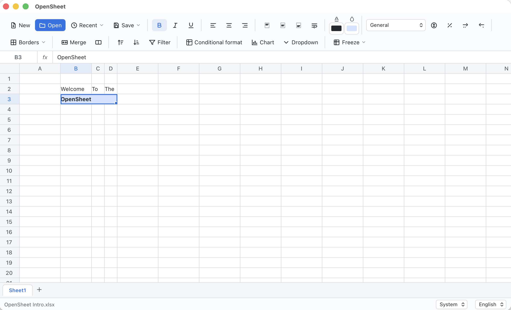

# OpenSheet

**한국어 문서: [README.ko.md](README.ko.md)**

A web-based spreadsheet editor that behaves like Microsoft Excel.
Open, edit, and save `.xlsx` and `.csv` files — with styles preserved.

It runs entirely in the browser (files never leave your machine) and can also be
deployed as a static site.



## Getting started

**macOS — no terminal needed:** double-click **`start.command`** in Finder. It
checks Node.js, installs dependencies on first run, starts the server, and opens
your browser automatically.

Or from a terminal:

```bash
npm install
npm run dev      # opens http://localhost:5173
```

Build / deploy:

```bash
npm run build    # outputs static files to dist/
npm run preview  # preview the production build
```

## Features

| Feature | Description |
| --- | --- |
| **Formulas / functions** | ~400 Excel-compatible functions such as `=SUM`, `=AVERAGE`, `=IF`, `=VLOOKUP` (powered by [HyperFormula](https://hyperformula.handsontable.com/)) |
| **Cell formatting** | Bold · italic · underline, text/fill color, horizontal & vertical alignment, text wrap, number formats (currency, percent, decimal, date), borders, and cell merging |
| **Styles round-trip** | Fonts, fills, colors (including theme/indexed), number formats, borders, column widths and row heights are read from and written back to `.xlsx` |
| **Conditional formatting** | Highlight cells by rule (greater/less than, between, equal, text contains) — evaluated live and round-tripped to `.xlsx` |
| **Cell notes** | Attach a note to any cell (red corner marker + hover tooltip); saved as `.xlsx` comments |
| **Data validation** | Give cells a dropdown list of allowed values (picker on the cell) — round-tripped to `.xlsx` |
| **Rows & columns** | Insert / delete rows and columns from the right-click menu — formulas, merges, notes and rules all shift accordingly |
| **Find & replace** | `Ctrl/Cmd+F` to find, `Ctrl/Cmd+H` to replace one or all |
| **Freeze panes** | Freeze leading rows/columns so headers stay visible while scrolling |
| **Auto-fill** | Drag the fill handle to extend a series (numbers) or copy values/formulas |
| **Undo / redo** | Full history for content, formatting, borders, merges, notes, rules and sorting |
| **Clipboard** | Copy · cut · paste over a range as TSV — formats are kept when pasting within the app, and it interoperates with Excel/Sheets |
| **Sorting** | Sort a selected range by its key column — relative formula references are automatically re-based by how far each row moved |
| **AutoFilter** | Turn a selection into a filter (header row gets dropdowns); pick values per column to show/hide matching rows |
| **Charts** | Turn a selected range into a bar / line / pie chart (labels from the first column, series from the header row) |
| **Multiple sheets** | Add / delete / rename sheet tabs, with cross-sheet references |
| **File I/O** | **New** blank workbook, open and save `.xlsx` / `.csv`; **Save As** to a new name/location; **Save in place** overwrites the opened file (Chromium browsers) or downloads a copy |
| **Recent files** | Quickly reopen recent files (stored locally in the browser; works on desktop and mobile) |
| **Autosave & recovery** | Your work is autosaved locally and restored when you reopen the app |
| **Print / PDF** | Print or export to PDF from the *Save* menu (grid-only print layout) |
| **Dark mode** | System / light / dark theme, switchable from the status bar |
| **Multi-language** | English / Korean UI, switchable from the status bar (remembers your choice) |
| **Installable (PWA)** | Install from the browser to run in its own window and work **offline** (service worker caches the app); desktop Chrome/Edge, Android, iOS |

## Usage

- **Move**: arrow keys / click / drag (range select), Shift+click (extend range)
- **Start editing**: double-click, `Enter`, `F2`, or just start typing (IME/Korean input supported)
- **Commit edit**: `Enter` (move down) / `Tab` (move right), `Esc` (cancel)
- **Delete**: `Delete` / `Backspace`
- **Undo / redo**: `Ctrl/Cmd+Z` / `Ctrl/Cmd+Shift+Z` (or `Ctrl+Y`)
- **Copy / cut / paste**: `Ctrl/Cmd+C` / `X` / `V`
- **Find / replace**: `Ctrl/Cmd+F` (find), `Ctrl/Cmd+H` (replace)
- **Save**: `Ctrl/Cmd+S` (saves in place if the file was opened with the picker, otherwise downloads `.xlsx`)
- **Print / PDF**: the *Save* toolbar menu ▸ *Print / PDF*
- **Formatting shortcuts**: `Ctrl/Cmd+B` (bold), `Ctrl/Cmd+I` (italic), `Ctrl/Cmd+U` (underline)
- **Borders**: the *Borders* toolbar menu (all / outer / top / bottom / left / right / none)
- **Conditional formatting**: the *Conditional format* toolbar button — add highlight rules for the selection
- **Insert / delete rows & columns, cell notes**: right-click (or long-press on touch) for the context menu
- **Auto-fill**: drag the small square at the selection's bottom-right corner
- **Freeze panes**: the *Freeze* toolbar menu
- **Formulas**: type an expression starting with `=` in a cell or the formula bar
- **Reference picking**: while editing a `=`formula, click (or drag) cells to insert their `A1` reference / range
- **Resize columns**: drag the column-header border
- **Rename a sheet**: double-click its tab
- **Theme / language**: switch from the selectors in the status bar

The status bar shows the live **count · sum · average** of the current selection.

## Mobile app (Android / iOS)

The UI is responsive and works in mobile browsers. To ship it as a native app,
the repo is configured for [Capacitor](https://capacitorjs.com/). The generated
`android/` and `ios/` projects are already committed, so you can go straight to
building — or regenerate them from scratch.

**One-time setup** (only if `android/` or `ios/` is missing):

```bash
npm install
npx cap add android          # Android Studio required
npx cap add ios              # Xcode required (Capacitor 8 uses Swift Package Manager — no CocoaPods needed)
```

**Build & run:**

```bash
npm run cap:android          # builds the web app, syncs, and opens Android Studio
npm run cap:ios              # ...and opens Xcode
```

Then press Run (device/emulator) or Archive to produce the `.apk` / `.ipa`. After
changing web code, run `npm run cap:sync` (or the `cap:*` scripts, which sync for you).

**App identity & assets:**

- App id (Android `applicationId` / iOS bundle id): `com.anttree.opensheet` — change it
  in [`capacitor.config.ts`](capacitor.config.ts) (and the native projects) before publishing.
- Icons & splash source art lives in [`assets/`](assets). After editing it, regenerate all
  sizes with:
  ```bash
  npx capacitor-assets generate --ios --android
  ```

> Notes:
> - Android builds need **JDK 17+**; Android Studio bundles a suitable one (the Capacitor
>   CLI may warn about an older system JDK — opening the project in Android Studio resolves it).
> - **Save in place** (File System Access API) is desktop-Chromium only. On mobile, opening
>   uses the system file picker and saving downloads a copy.

## Desktop app (macOS / Windows / Linux)

OpenSheet can be packaged as a small native desktop app with [Tauri](https://tauri.app/).
Just like the mobile apps, it runs the same web build inside the OS's own web view
(WKWebView on macOS, WebView2 on Windows, WebKitGTK on Linux) instead of bundling a
browser — so the app stays tiny (**~5–15 MB**, versus ~150 MB for an Electron build).

**One-time setup:** install the [Rust toolchain](https://www.rust-lang.org/tools/install)
(`rustup`) and your platform's [Tauri prerequisites](https://v2.tauri.app/start/prerequisites/).
On macOS that's just Xcode Command Line Tools (`xcode-select --install`).

**Run & build:**

```bash
npm run tauri dev      # develop in a native window (hot reload)
npm run tauri build    # produce the native app + installer
```

The build outputs to `src-tauri/target/release/bundle/`:

- **macOS** — `macos/OpenSheet.app` and `dmg/OpenSheet_<version>_*.dmg`
- **Windows** — `msi/` and `nsis/` installers
- **Linux** — `deb/`, `rpm/`, `appimage/`

**macOS architectures** — `npm run tauri build` targets your Mac's own architecture
(Apple Silicon → `arm64`, Intel → `x86_64`; check with `uname -m`). To build a specific
one or cross-compile:

```bash
# Apple Silicon (arm64)
rustup target add aarch64-apple-darwin
npm run tauri build -- --target aarch64-apple-darwin

# Intel (x86_64)
rustup target add x86_64-apple-darwin
npm run tauri build -- --target x86_64-apple-darwin

# Universal — one app that runs on both Apple Silicon and Intel
rustup target add aarch64-apple-darwin x86_64-apple-darwin
npm run tauri build -- --target universal-apple-darwin
```

App id (`com.anttree.opensheet`), window size and bundle settings live in
[`src-tauri/tauri.conf.json`](src-tauri/tauri.conf.json). Icons are in `src-tauri/icons/` —
regenerate them from a source PNG with `npm run tauri icon <path/to/icon.png>`.

> Unsigned builds run locally (right-click ▸ Open on macOS to bypass Gatekeeper the first
> time). To distribute widely, code-sign & notarize (macOS) or sign (Windows) per the
> [Tauri distribution guide](https://v2.tauri.app/distribute/).

## Tech stack

- **Vite + React + TypeScript** — UI and grid rendering
- **HyperFormula** — Excel-compatible formula engine
- **ExcelJS** — `.xlsx` reading/writing with full cell styling
- **Zustand** — state management

## Project structure

```
src/
  App.tsx              layout + global shortcuts (save, undo, clipboard, find) + autosave + status bar
  i18n.ts              English/Korean strings + language store
  theme.ts             light/dark/system theme store
  components/
    Toolbar.tsx        file I/O · formatting · borders · merge · sort · conditional-format controls
    FormulaBar.tsx     name box + formula input
    Grid.tsx           spreadsheet grid (selection, editing/IME, merges, borders, freeze, fill, notes)
    SheetTabs.tsx      sheet tabs
    ContextMenu.tsx    right-click / long-press menu (insert/delete, notes, clipboard)
    FindReplace.tsx    find & replace panel
    CondFormatPanel.tsx  conditional-formatting rule editor
    Icon.tsx           inline SVG icon loader
  icons/               hand-drawn SVG toolbar icons
  store/useStore.ts    Zustand store wrapping HyperFormula (editing, undo/redo, clipboard, notes, rules)
  lib/
    fileIO.ts          ExcelJS-based xlsx/csv read & write (styles, borders, sizes, notes, rules)
    format.ts          number/date display formatting + border helpers
    condFormat.ts      conditional-formatting evaluation + Excel operator mapping
    recentFiles.ts     IndexedDB recent-files list + autosave draft
    utils.ts           address conversion · selection · formula-reference shifting
  types.ts             shared types
```

## Known limitations

- The grid provides 5000 rows × 78 columns (A–BZ), rendered with row virtualization so only the visible slice is in the DOM. Adjust `MAX_ROWS` / `MAX_COLS` in `store/useStore.ts` if needed.
- **Save in place** uses the File System Access API and works in Chromium browsers (Chrome/Edge); elsewhere saving downloads a copy.
- The legacy `.xls` format is not supported — re-save as `.xlsx` first.
- Theme/indexed colors are resolved with the default Office palette, so custom-themed workbooks may differ slightly.
- The sort's formula-reference adjustment targets the common case of same-row references (e.g. `=B2*C2`).

## License

[MIT](LICENSE) © Ant-tree
